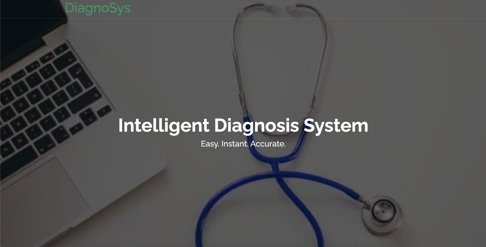

<h1 align="center">DiagnoSys.AI</h1>

<h2>About:</h2>

Introducing **DiagnoSys.AI**, an advanced web-based healthcare assistance software designed to aid both the general public and radiologists in accurately identifying cataracts from fundus images of the eye and brain tumors from MRI scans of the brain. This cutting-edge system has been developed through extensive research and the creation of innovative deep learning models, utilizing multiple benchmark datasets for Ocular diseases and Brain Tumor detection.

The Cataract Detection system utilizes a custom-designed CNN-LSTM model, carefully crafted to achieve superior performance in identifying cataracts from fundus images. On the other hand, the Brain Tumor Detection system makes use of a fine-tuned EfficientNet-3 model, ensuring precise and reliable results in detecting brain tumors from MRI scans.

The vision of this project was to leverage latest advancements in artificial intelligence and machine learning for critical medical conditions to ensure highest level of assistance and support in the field of healthcare diagnostics.

### Tech Stack of this Project:

* Python
* TensorFlow
* JavaScript
* Flask
* HTML
* CSS

<h2>Snapshots of our Webpage:</h2>

<br>

<div align="center">
 
<br>
<br>

</div>

<br>

<h2>Citation</h2>
If you wish to cite this project, feel free to use this BibTeX reference:

```
@article{padalia2022cnn,
         title={A CNN-LSTM Combination Network for Cataract Detection using Eye Fundus Images},
         author={Padalia, Dishant and Mazumdar, Abhishek and Singh, Bharati},
         journal={arXiv preprint arXiv:2210.16093},
         year={2022}
}
```
